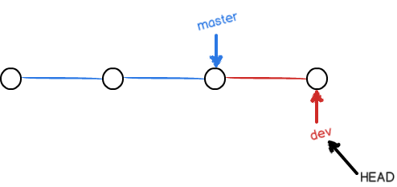

# Git教程

## Git简介

+ Git是一个分布式的版本控制系统。

  分布式：首先，分布式版本控制系统根本没有“中央服务器”，每个人的电脑上都是一个完整的版本库，这样，你工作的时候，就不需要联网了，因为版本库就在你自己的电脑上。既然每个人电脑上都有一个完整的版本库，那多个人如何协作呢？比方说你在自己电脑上改了文件A，你的同事也在他的电脑上改了文件A，这时，你们俩之间只需把各自的修改推送给对方，就可以互相看到对方的修改了。

  和集中式版本控制系统相比，分布式版本控制系统的安全性要高很多，因为每个人电脑里都有完整的版本库，某一个人的电脑坏掉了不要紧，随便从其他人那里复制一个就可以了。而集中式版本控制系统的中央服务器要是出了问题，所有人都没法干活了。

  在实际使用分布式版本控制系统的时候，其实很少在两人之间的电脑上推送版本库的修改，因为可能你们俩不在一个局域网内，两台电脑互相访问不了，也可能今天你的同事病了，他的电脑压根没有开机。因此，分布式版本控制系统通常也有一台充当“中央服务器”的电脑，但这个服务器的作用仅仅是用来方便“交换”大家的修改，没有它大家也一样干活，只是交换修改不方便而已。

  

### Git安装

+ 安装过程略

+ 安装完成后，还需要最后一步设置，在命令行输入：

  ```cmd
  git config --global user.name "Your Name"
  git config --global user.email "email@example.com"
  ```

  因为Git是分布式版本控制系统，所以，每个机器都必须自报家门：你的名字和Email地址。你也许会担心，如果有人故意冒充别人怎么办？这个不必担心，首先我们相信大家都是善良无知的群众，其次，真的有冒充的也是有办法可查的。

  注意`git config`命令的`--global`参数，用了这个参数，表示你这台机器上所有的Git仓库都会使用这个配置，当然也可以对某个仓库指定不同的用户名和Email地址。

## 创建版本库

+ 版本库

  版本库又名仓库，英文名**repository**，你可以简单理解成一个目录，这个目录里面的所有文件都可以被Git管理起来，每个文件的修改、删除，Git都能跟踪，以便任何时刻都可以追踪历史，或者在将来某个时刻可以“还原”。

+ 创建

  通过`git init`命令把这个目录变成Git可以管理的仓库：

  ```cmd
  git init
  ```

+ 把一个文件放到Git仓库只需要两步

  第一步，用命令`git add`告诉Git，把文件添加到仓库：

  ```cmd
  git add readme.txt
  ```

  执行上面的命令，没有任何显示，这就对了，Unix的哲学是“没有消息就是好消息”，说明添加成功。

  第二步，用命令`git commit`告诉Git，把文件提交到仓库：

  ```cmd
  git commit -m "wrote a readme file"
  [master (root-commit) eaadf4e] wrote a readme file
   1 file changed, 2 insertions(+)
   create mode 100644 readme.txt
  ```

  简单解释一下`git commit`命令，`-m`后面输入的是本次提交的说明，可以输入任意内容，当然最好是有意义的，这样你就能从历史记录里方便地找到改动记录。

## 时光机穿梭

+ `git status`命令可以让我们时刻掌握仓库当前的状态

+ `git diff`顾名思义就是查看difference

  ```cmd
  git diff readme.txt 
  diff --git a/readme.txt b/readme.txt
  index 46d49bf..9247db6 100644
  --- a/readme.txt
  +++ b/readme.txt
  @@ -1,2 +1,2 @@
  -Git is a version control system.
  +Git is a distributed version control system.
   Git is free software.
  ```

### 版本回退

+ 每当你觉得文件修改到一定程度的时候，就可以“保存一个快照”，这个快照在Git中被称为`commit`。一旦你把文件改乱了，或者误删了文件，还可以从最近的一个`commit`恢复，然后继续工作，而不是把几个月的工作成果全部丢失。

+ 版本控制系统肯定有某个命令可以告诉我们历史记录，在Git中，我们用`git log`命令查看：

  退出摁英文状态的`Q`

  ```
  git log
  ```

+ 如果嫌输出信息太多，看得眼花缭乱的，可以试试加上`--pretty=oneline`参数：

  ```cmd
  git log --pretty=oneline
  1094adb7b9b3807259d8cb349e7df1d4d6477073 (HEAD -> master) append GPL
  e475afc93c209a690c39c13a46716e8fa000c366 add distributed
  eaadf4e385e865d25c48e7ca9c8395c3f7dfaef0 wrote a readme file
  ```

  大串类似`1094adb...`的是`commit id`（版本号），和SVN不一样，Git的`commit id`不是1，2，3……递增的数字，而是一个SHA1计算出来的一个非常大的数字，用十六进制表示，而且你看到的`commit id`和我的肯定不一样，以你自己的为准。为什么`commit id`需要用这么一大串数字表示呢？因为Git是分布式的版本控制系统，后面我们还要研究多人在同一个版本库里工作，如果大家都用1，2，3……作为版本号，那肯定就冲突了。

  每提交一个新版本，实际上Git就会把它们自动串成一条时间线。如果使用可视化工具查看Git历史，就可以更清楚地看到提交历史的时间线：

+ 首先，Git必须知道当前版本是哪个版本，在Git中，用`HEAD`表示当前版本，也就是最新的提交`1094adb...`（注意我的提交ID和你的肯定不一样），上一个版本就是`HEAD^`，上上一个版本就是`HEAD^^`，当然往上100个版本写100个`^`比较容易数不过来，所以写成`HEAD~100`。

+ 现在，我们要把当前版本`append GPL`回退到上一个版本`add distributed`，就可以使用`git reset`命令：

  ```cmd
  git reset --hard HEAD^
  HEAD is now at e475afc add distributed
  ```

+ 还可以继续回退到上一个版本`wrote a readme file`，不过且慢，然我们用`git log`再看看现在版本库的状态：

+ 最新的那个版本`append GPL`已经看不到了！好比你从21世纪坐时光穿梭机来到了19世纪，想再回去已经回不去了，肿么办？

  办法其实还是有的，只要上面的命令行窗口还没有被关掉，你就可以顺着往上找啊找啊，找到那个`append GPL`的`commit id`是`1094adb...`，于是就可以指定回到未来的某个版本：

+ 版本号没必要写全，前几位就可以了，Git会自动去找。当然也不能只写前一两位，因为Git可能会找到多个版本号，就无法确定是哪一个了。

+ Git的版本回退速度非常快，因为Git在内部有个指向当前版本的`HEAD`指针，当你回退版本的时候，Git仅仅是把HEAD从指向`append GPL`：

  ```ascii
  ┌────┐
  │HEAD│
  └────┘
     │
     └──> ○ append GPL
          │
          ○ add distributed
          │
          ○ wrote a readme file
  ```

  ```ascii
  ┌────┐
  │HEAD│
  └────┘
     │
     │    ○ append GPL
     │    │
     └──> ○ add distributed
          │
          ○ wrote a readme file
  ```

+ 现在，你回退到了某个版本，关掉了电脑，第二天早上就后悔了，想恢复到新版本怎么办？找不到新版本的`commit id`怎么办？

  在Git中，总是有后悔药可以吃的。当你用`$ git reset --hard HEAD^`回退到`add distributed`版本时，再想恢复到`append GPL`，就必须找到`append GPL`的commit id。Git提供了一个命令`git reflog`用来记录你的每一次命令：

  ```cmd
  git reflog
  e2464d3 (HEAD -> win10, origin/win10) HEAD@{0}: commit: Fight with pan.
  06bb745 HEAD@{1}: commit: Finsh the basic of Python400
  c9619e8 (origin/master, origin/HEAD) HEAD@{2}: pull origin master: Fast-forward
  ```
  

### 工作区和暂存区

+ 工作区

  电脑里能看到的目录

+ 版本库

  工作区有一个隐藏目录`.git`，这个不算工作区，而是Git的版本库。

  Git的版本库里存了很多东西，其中最重要的就是称为stage（或者叫index）的暂存区，还有Git为我们自动创建的第一个分支`master`，以及指向`master`的一个指针叫`HEAD`。

  

  第一步是用`git add`把文件添加进去，实际上就是把文件从工作区修改添加到暂存区；

  第二步是用`git commit`提交更改，实际上就是把暂存区的所有内容提交到当前分支。

### 撤销修改

+ Git会告诉你，`git checkout -- file`可以**丢弃工作区的修改**：

  ```cmd
  $ git checkout -- readme.txt
  ```

  命令`git checkout -- readme.txt`意思就是，把`readme.txt`文件在工作区的修改全部撤销，这里有两种情况：

  一种是`readme.txt`自修改后还没有被放到暂存区，现在，撤销修改就回到和版本库一模一样的状态；

  一种是`readme.txt`已经添加到暂存区后，又作了修改，现在，撤销修改就回到添加到暂存区后的状态。

  总之，就是让这个文件回到最近一次`git commit`或`git add`时的状态。

+ 场景1：当你改乱了工作区某个文件的内容，想直接丢弃工作区的修改时，用命令`git checkout -- file`。

+ 场景2：当你不但改乱了工作区某个文件的内容，还添加到了暂存区时，想丢弃修改，分两步，第一步用命令`git reset HEAD <file>`，就回到了场景1，第二步按场景1操作。

## 远程仓库

+ Git是分布式版本控制系统，同一个Git仓库，可以分布到不同的机器上。

+ 实际情况往往是这样，找一台电脑充当服务器的角色，每天24小时开机，其他每个人都从这个“服务器”仓库克隆一份到自己的电脑上，并且各自把各自的提交推送到服务器仓库里，也从服务器仓库中拉取别人的提交。

+ 好在这个世界上有个叫[GitHub](https://github.com/)的神奇的网站，从名字就可以看出，这个网站就是提供Git仓库托管服务的，所以，只要注册一个GitHub账号，就可以免费获得Git远程仓库。

+ 由于你的本地Git仓库和GitHub仓库之间的传输是通过SSH加密的，所以，需要一点设置：

  + 第1步：创建SSH Key。在用户主目录下，看看有没有.ssh目录，如果有，再看看这个目录下有没有`id_rsa`和`id_rsa.pub`这两个文件，如果已经有了，可直接跳到下一步。如果没有，打开Shell（Windows下打开Git Bash），创建SSH Key：

    ```cmd
    $ ssh-keygen -t rsa -C "youremail@example.com"
    ```

    如果一切顺利的话，可以在用户主目录里找到`.ssh`目录，里面有`id_rsa`和`id_rsa.pub`两个文件，这两个就是SSH Key的秘钥对，`id_rsa`是私钥，不能泄露出去，`id_rsa.pub`是公钥，可以放心地告诉任何人。

  + 登陆GitHub，打开“Account settings”，“SSH Keys”页面：

    然后，点“Add SSH Key”，填上任意Title，在Key文本框里粘贴`id_rsa.pub`文件的内容：

+ 为什么GitHub需要SSH Key

  因为GitHub需要识别出你推送的提交确实是你推送的，而不是别人冒充的，而Git支持SSH协议，所以，GitHub只要知道了你的公钥，就可以确认只有你自己才能推送。

### 添加远程仓库

+ 创建成功后有两个选项

  可以从这个仓库克隆出新的仓库

  也可以把一个已有的本地仓库与之关联，然后，把本地仓库的内容推送到GitHub仓库

+ 现在，我们根据GitHub的提示，在本地的`learngit`仓库下运行命令：

  ```cmd
  $ git remote add origin git@github.com:michaelliao/learngit.git
  ```

  添加后，远程库的名字就是`origin`，这是Git默认的叫法，也可以改成别的，但是`origin`这个名字一看就知道是远程库。

+ 下一步，就可以把本地库的所有内容推送到远程库上：

  ```cmd
  git push -u origin master
  ```

  把本地库的内容推送到远程，用`git push`命令，实际上是把当前分支`master`推送到远程。

  由于远程库是空的，我们第一次推送`master`分支时，加上了`-u`参数，Git不但会把本地的`master`分支内容推送的远程新的`master`分支，还会把本地的`master`分支和远程的`master`分支关联起来，在以后的推送或者拉取时就可以简化命令。

### 从远程库克隆

```cmd
 git clone git@github.com:michaelliao/gitskills.git
```

## 分支管理

## 创建与合并分支

+ 一开始的时候，`master`分支是一条线，Git用`master`指向最新的提交，再用`HEAD`指向`master`，就能确定当前分支，以及当前分支的提交点：

  

  每次提交，`master`分支都会向前移动一步，这样，随着你不断提交，`master`分支的线也越来越长。

+ 当我们创建新的分支，例如`dev`时，Git新建了一个指针叫`dev`，指向`master`相同的提交，再把`HEAD`指向`dev`，就表示当前分支在`dev`上：

  

+ 从现在开始，对工作区的修改和提交就是针对`dev`分支了，比如新提交一次后，`dev`指针往前移动一步，而`master`指针不变：

  

+ 假如我们在`dev`上的工作完成了，就可以把`dev`合并到`master`上。Git怎么合并呢？最简单的方法，就是直接把`master`指向`dev`的当前提交，就完成了合并：

  

+ 合并完分支后，甚至可以删除`dev`分支。删除`dev`分支就是把`dev`指针给删掉，删掉后，我们就剩下了一条`master`分支：

  


查看分支：`git branch`

创建分支：`git branch <name>`

切换分支：`git checkout <name>`或者`git switch <name>`

创建+切换分支：`git checkout -b <name>`或者`git switch -c <name>`

合并某分支到当前分支：`git merge <name>`

删除分支：`git branch -d <name>`

## 解决冲突

+ `master`分支和`feature1`分支各自都分别有新的提交，变成了这样：

  

+ Git无法执行“快速合并”，只能试图把各自的修改合并起来，但这种合并就可能会有冲突，我们试试看：

  ```cmd
  git merge feature1
  Auto-merging readme.txt
  CONFLICT (content): Merge conflict in readme.txt
  Automatic merge failed; fix conflicts and then commit the result.
  ```

+ 果然冲突了！Git告诉我们，`readme.txt`文件存在冲突，必须手动解决冲突后再提交。`git status`也可以告诉我们冲突的文件：

+ Git用`<<<<<<<`，`=======`，`>>>>>>>`标记出不同分支的内容，我们修改如下后保存：

+ 再提交：

  ```cmd
  $ git add readme.txt 
  $ git commit -m "conflict fixed"
  [master cf810e4] conflict fixed
  ```

+ 现在，`master`分支和`feature1`分支变成了下图所示：

  

+ 用`git log --graph`命令可以看到分支合并图。

### 分支管理

+ 合并分支时，如果可能，Git会用`Fast forward`模式，但这种模式下，删除分支后，会丢掉分支信息。

+ 如果要强制禁用`Fast forward`模式，Git就会在merge时生成一个新的commit，这样，从分支历史上就可以看出分支信息。

  下面我们实战一下`--no-ff`方式的`git merge`：

  ```cmd
  git merge --no-ff -m "merge with no-ff" dev
  ```

+ 可以看到，不使用`Fast forward`模式，merge后就像这样：

  

+ 分支策略

  + 首先，`master`分支应该是非常稳定的，也就是仅用来发布新版本，平时不能在上面干活；
  + 干活都在`dev`分支上，也就是说，`dev`分支是不稳定的，到某个时候，比如1.0版本发布时，再把`dev`分支合并到`master`上，在`master`分支发布1.0版本；

### Bug分支

+ 修复bug时，我们会通过创建新的bug分支进行修复，然后合并，最后删除；
+ 当手头工作没有完成时，先把工作现场`git stash`一下，然后去修复bug，修复后，再`git stash pop`，回到工作现场；
+ 在master分支上修复的bug，想要合并到当前dev分支，可以用`git cherry-pick <commit>`命令，把bug提交的修改“复制”到当前分支，避免重复劳动。

### Feature分支

+ 开发一个新feature，最好新建一个分支；
+ 如果要丢弃一个没有被合并过的分支，可以通过`git branch -D <name>`强行删除。