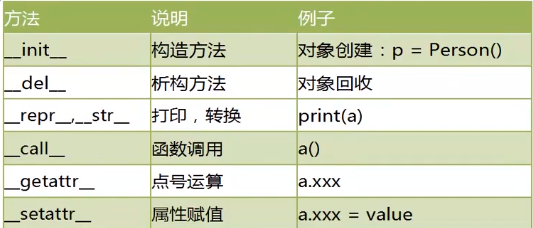
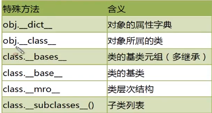

# Python教程400集

## 1.Python介绍

- 一种解释器(性能较低)、面向对象的语言
- 由Guido van Rossum(龟叔)于1989年发明， 1991年正式公布
- “马戏团”
- 特点
  - 可读性强
  - 简洁、简洁、简洁
  - 面向对象
  - 免费开源
  - 可移植和跨平台
  - 丰富的库
  - 可扩展性
- 应用范围
  - 科学计算
  - 人工智能
  - ……

## 2.Python配置

## 3.Python开发环境

## 4.PythonIDE使用

## 5.Python基本格式

- 空格和缩进
- 区分大小写
- 注释
  - 行注释：#
  - 段注释：'''注释'''

## 6.错误处理

- 守
- 破
- 离
- 《程序员修炼手册》

## 7.海归绘图

## 8.海归绘图

## 9.程序构成

- 程序由模块组成，对应.py文件
- 模块由语句组成
- 语句为构成单元

## 10.对象

- **Python中，一切皆对象。**对象：标识(对应于内存中的地址，id(obj))、类型(type(obj))、值(print()obj)。
- 对象的本质就是：一个内存块，拥有特定的值，支持特定类型的操作。

## 11.引用的本质_栈内存_堆内存_内存示意图

- 引用　
  - 变量也成为：对象的引用。因为变量储存的就是对象的地址。变量通过地址引用了对象
  - 变量位于：堆内存
  - 对象位于：栈内存
- Python是动态类型语言
  - 变量不用显示声明，自动确定
- Python是强类型语言
  - 每个对象都有数据类型

## 12.标识符_命名规则

- 基本用法
  1. 区分大小写
  2. 第一个非数字
  3. 不能用关键词
  4. 避免双下划线开头结尾

## 13.变量的声明_初始化\_删除\_GC

- a = 3
- del a 

## 14.链式赋值_系列解包赋值\_常量

- 链式赋值 x=y=300
- 系列解包赋值 x,y=1,2 
- 不支持常量

## 15.内置数据类型_算术运算

- divmod(x, y)同时得到商和余数

## 16.整数_进制　　　

## 17.浮点数_自动/强制转换\_增强赋值运算

- int(3.9)
- round(3.9)

## 18.时间相关

## 19.多点坐标

## 20.布尔值_比较/逻辑运算符

- True False 本质为　１　０

## 21.同一运算符_整数缓存问题

- is 和 == 区别

  is 判断两个变量引用的对象是否为同一个，即对象的地址

  == 判断两个变量引用的对象的值是否相同，默认调用对象的_\_eq\_\_()

- 整数缓存问题

  在命令行中，python针对较小的整数对象进行缓存([-5, 256])

  在文件中，这个范围为([-5, 任意整数])

  ```python 
  >>>a = 10
  >>>b = 10
  >>>a is b
  # 输出
  True
  ```

  

## 22.字符串_unicode字符集\_三种创建字符串的方式\_len()

- 字符串的本质：字符序列，**不可变**

- 字符串的编码

  Python3支持Unicode,可以表示任何书面语言的字符。Python3的字符默认16位的Unicode编码，ASCII码是Unicode的子集

  使用ord()转Unicode码

  使用chr()把十进制转字符

- 使用单双引号创建字符串

- 使用三个单双引号创建多行字符串

- 允许字符串

  ```python
  >>>a  = ''
  >>>len(a)
  
  0
  ```

  

## 23.字符串_转义字符\_字符串拼接\_字符串复制\_input()

- 转义字符'\\'

- 字符串拼接

  +

  - 都为字符串：拼接
  - 都为数字：加法
  - 不同：抛出异常

  直接放到一起进行拼接

- 字符串复制

  a = "123" * 20

- 不换行打印

  print("123",end=''+")

- a = input("请输入：")

## 24.字符串_str()\_[]提取字符串\_replace()

- str(123) 类似 int() float()
- a.replace()　返回新字符串

## 25.字符串_切片slice操作

- 标准格式[起始偏移量:终止偏移量:步长(间隔)]
- 起始/终止超过字符串范围**不报错**

## 26.字符串_split()\_join()

- a.split() 默认为空格，返回列表
- ''.join(a),a为列表

## 27.字符串_驻留机制\_内存分析\_字符串同一判断\_值相等

- 字符串驻留

  仅保留一份相同且不可变字符串的防范，只针对于符合标识符规则的字符串

  ```python
  >>> a = "abc"
  >>> b = "abc"
  >>> a is b
  
  True
  >>> a = "#abc"
  >>> b = "#abc"
  >>> a is b
  
  False
  >>> a = "ab"
  >>> b = "ab"
  >>> a + b is "abab"
  >>> a + b == "abab"
  
  False
  True
  ```

- 成员操作符

  in 

  ```python
  >>> a in "abc"
  
  True
  ```

  

## 28.字符串_常用查找方法\_去除首位信息\_大小写转换\_排版

- 去除首位信息

  strip()默认空格

  lstrip()

  rstrip()

- 大小写转换

  a.capitalize()首字母

  a.title()每个首字母

  a.upper()

  a.lower()

  a.swapcase()转换

- 排版

  ```python
  >>>a = "123"
  >>>a.center(10,"*") #默认为空格，ljust rjust为左右对齐
  #输出
  "***123****"
  ```

- 其他方法

  1. isalnum() 字母或数字
  2. isalpha()　只有字母(包括汉字)
  3. isdigit() 只由数字
  4. isspace()
  5. isupper()
  6. islower()

## 29.字符串\_format格式化_数字格式化操作

## 30.可变字符串_io.StringIO

```python
>>> import io

>>> s = "123"
>>> sio = io.StringIO(s)
>>> sio.getvalue()
"123"
>>> sio.seek(0)
0
>>> sio.write("0")
1
>>> sio.getvalue()
"023"
```

## 31.运算符总结_位操作符\_优先级问题

## 32.列表_特点\_内存分析


## 33.创建列表的四种方法

1. a = []

2. a = list() # 可以将任何可迭代的数据转化为列表

   list(range(10))

   list("woaini")

3. list(range(3, 15, 2))

4. 推导式

   a = [x*2 for x in range(5)]

## 34.列表_元素的５种添加方式\_效率分析

列表存在自动内存管理，在尾部添加删除时，涉及的元素少，速度快

1. a.append() # 速度最快
2. \+ 拼接新旧列表，生成新列表
3. a.extend() # 也是拼接但不产生新对象
4. a.insert(index,element) # 影响处理速度　的类似的还有：remove()/pop()/del()
5. a = [1, 2] b = a * 3 #　类似的还有字符串、元祖。

## 35.列表_元素删除的三种方式\_删除的本质分析

1. del a[index] # 无返回
2. a.pop() / a.pop(index)　# 有返回
3. a.remove(element)

## 36.列表_元素的访问\_元素出现次数统计\_成员资格判断

1. a.index(element, start, end)
2. a.count(element) # 为０则不存在　

## 37.列表_切片操作

## 38.列表_排序\_逆序\_max/min/sum

## 39.列表_二维列表\_表格数据的存储和读取

## 40.元组_特点\_创建\_tuple()要点

- 元组

  不可变，列表是可变序列

- 创建

  1. a = (12, 12) # **a = (12,)**
  2. tuple(可迭代对象)
     - b = tuple("1234")
     - b = tuple(range(3))

## 41.元组_元素访问\_计数方法\_切片操作_成员资格判断

## 42.元组_生成器推导式创建元组\_总结

```python
>>> s = (x*2 for x in range(5))
>>> s
<generator object <genexpr> at 0x7f24249f8bd0>
>>>tuple(s) # 只能访问一次，第二次为空
(0, 2, 4, 6, 8)
>>>list(s)
[]
```

## 43.字典\_特点\_4种创建方式

- 字典是“键值对”的无序可变序列

- “键”是任意的不可变数据，如数字，字符串，元组，列表集合不可以；不可重复

- “值”任意可重复

- 创建

  1. a = {}; a = dict(naem = "123", age = 18) ; a = dict([("name", "gaoqi"),("agge", 18)])

  2. k = ["nake", "age"]

     v = ["gaoqi", 18]

     d = dict(zip(k, v))

  3. a = dict.fromkeys(["name", age]) # 所有的值都为None

## 44.字典\_元素的访问\_键的访问\_值的访问\_键值对的

1. a['name'] 不存在返回异常
2. a.get("name", "不存在") 不存在返回None，亦可以是定义好的"不存在"
3. a.items()
4. a.keys()
5. a.values()
6. "name" in a

## 45.字典_元素的添加删除修改

1. a["123"] = "123"　添加

2. 字典　a b

   a.update(b)

3. del(a["name"])

4. a.pop("name") 可以返回值

5. a.popitem()　随机删除并返回

## 46.字典\_序列解包用于列表元组字典

1. (a, b) = (1, 2)

2. [a, b] = [1, 2]

3. s = {"name":"123", "age":12}

   a ,b = s

   a = "name" b = "age"

   a, b = s.items()

   a,b = a.values()

## 47.字典\_复杂表格数据存储\_列表和字典综合嵌套

## 48.字典\_核心底层原理\_内存分析\_存储键值对过程

## 49.字典\_核心底层原理\_内存分析\_查找值对象过程

## 50.集合\_特点\_创建和删除\_交集并集差集运算

+ 集合无序可变，不能重复，类似于字典的“键”

+ 创建

  1. a = {1, 2, 3}
  2. set(),将列表元组变为集合 a = [1, 2] b = set(a)
  3. remove(value), clear()

+ 相关操作

  a|b   ;　a.union(b)

  a&b   ; a.intersection(b)

  a-b   ;  a.difference(b) 

## 51.Pycharm开发环境的下载安装配置_项目管理

## 52.单分支选择结构_条件表达式详解

## 53.双分支选择结构_三元运算符的使用详解

## 54.多分支选择结构

## 55.选择结构的嵌套

## 56.while循环结构_死循环处理

## 57.for循环结构_遍历各种可迭代对象_range对象

+ for x in d # ｄ是字典

  打印键，相当于 for x in d.keys()

  for x in d.values()

  for x in d.items() 

## 58.嵌套循环

## 59.嵌套循环练习_九九乘法表_打印表格数据

## 60.break语句

## 61.continue语句

## 62.else语句

```python
while ...:
	...
else:
	...
或者
for x in d:
	...
else:
	...
# 如果循环体没有被break结束，则会执行else语句
```

## 63.循环代码优化技巧（及其重要）

1. 减少循环内部计算
2. 减少内层循环计算
3. 使用局部变量
4. 连接尽量使用join()热不是+
5. 有序列表在尾部操作

## 64.zip()并行迭代

```python
a = []

b = {}

c = ()

for x,y,z in zip(a, b, c):

	...
# 以最短为基准
```

## 65.推导式创建序列_列表推导式_字典推导式_集合推导

1. 列表推倒式

   [x for x in range(1, 5)]

2. 字典推导式

   {key : value for 表达式　in 可迭代对象}

3. 集合推导式

   {x for x in range(5)}

4. 生成器推导式(并不能生成元组)只能生成一次

   f = (x for x in range(5))　#是一个生成器对象

## 66.综合练习_绘制不同颜色的多个同心圆_绘制棋盘

## 67.函数的基本概念_内存分析_函数的分类_定义和调

## 68.形参和实参\_文档字符串_函数注释

```python
def print():
	"""这就是文档字符串"""
	
help(print.__doc__) #可以打印函数和文档字符串
```

## 69.返回值详解 

## 70.函数也是对象_内存分析

## 71.变量的作用域\_全局变量_局部变量_栈帧内存分析讲解

+ stack frame # 栈帧

## 72.局部变量和全局变量_效率测试

+ 局部变量高于全局变量

## 73.参数的传递_传递可变对象_内存分析

+ 参数的传递都是“引用传递”，不是“值传递”
+ 具体操作
  1. 对可变对象，直接作用于元对象
  2. 对不可变对象，会产生一个新的对象空间

## 74.参数的传递_传递不可变对象_内存分析

## 75.浅拷贝和深拷贝_内存分析

1. copy()

   只拷贝对象的引用

2. deepcopy()

   同时拷贝对象的内存，对子对象的操作不影响原对象

## 76.参数的传递_不可变对象含可变子对象\_内存分析

## 77.参数的类型\_位置参数\_默认值参数_命名参数

1. 位置参数

   ```python
   def fi(a, b):
   	...
   fi(1, 2) 
   fi(1) #报错
   ```

2. 默认值参数

   ```python
   def fi(a, b, c = 10):
   	...
   fi(1, 2)
   fi(1, 2, 3) #都正确
   ```

3. 命名参数

   ```python
   def fi(a, b):
   	...
   fi(b = 2， a = 10) #位置参数
   fi(1, 2) #位置参数
   ```

## 78.参数的类型\_可变参数_强制命名参数

1. 可变参数

   1. *param, 将多个参数收集到元祖中

      ```python
      def f1(a, b, *c):
      	...
      f1(1, 2, 3, 4) #3, 4都放在*c中
      ```

   2. **param，放到字典中

      ```
      def f2(a, b, **c):
      	...
      f2(1, 3, name="123", age=12)
      ```

2. 强制命名参数

   在可变参数的后面增加新的参数，调用时必须是“强制命名参数”

   ```python
   def f1(*a, b, c):
   	...
   f1(1, 2, b = 3, c = 3)
   ```

## 79.lambda表达式和匿名函数

+ lambda表达式可以声明匿名函数。是一种简单的、在一行定义的函数。实际生成一个函数对象

+ 只允许一个表达式，不能包含复杂语句，计算结果就是返回值

+ 基本用法：

  ```python
  >>>f = lambda a,b,c:a+b+c
  >>>print(f)
  <function <lambda> at 0x006A07C8>
  >>>print(f(2,3,4))
  9
  ```

## 80.eval()函数用法

+ 将字符串str当成有效的表达式来求值并返回计算结果

+ 语法

  eval(source[, globals[, locals]]) -> value

  source:一个python表达式或者函数compile()返回的代码对象

  globals:可选，必须是dictionary

  locals:可选。任意映射对象

+ ```python
  >>>eval("2+3")
  5
  >>>dict1 = dict(a=10.b=20)
  >>>eval("a+b",dict1)
  30
  ```

## 81.递归函数\_函数调用内存分析\_栈帧的创建

## 82.递归函数_阶乘计算案例

## 83.嵌套函数\_内部函数\_数据隐藏

+ 在函数内部定义的函数

+ 特点：

  1. 封装-隐藏数据

  2. DRY原则Don't repeat Yourself 

     避免代码重复

  3. 闭包

## 84.nonlocal_global

+ nonlocal

  用于修改外层的局部变量

+ global

  用于修改全局变量

## 85.LEGB规则

+ python在查找“名称”时，按照LEGB规则：

  local(函数或类的内部) -> enclosed(嵌套函数) -> global(全局变量) -> built in(python保留的特殊名称)

+ 都没有报错Namerror

## 86.面向对象和面向过程的区别\_执行者思维\_设计者思维

## 87.对象的进化故事

## 88.类的定义_类和对象的关系

+ 类定义数据类型的属性和方法
+ 对象是类的具体实例，称作类的实例
+ 类的对象共享类的方法，但会有自己的属性。

## 89.构造函数\__init__

1. 名称固定
2. 第一个参数为self
3. 用来初始化类的实例的属性值
4. \__new__():用于创建对象，一般无需定义
5. **self 必须为构造函数的第一个参数，名字任意，一般为self。类似于指针，this**

## 90.实例属性_内存分析

1. 一般在\__init__()定义

   self.name = 初始值

2. 在其他方法中可以通过self.name调用

3. 可以通过实例对象访问

   obj.name = value

## 91.实例方法\_内存分析方法调用过程\_dir()_isinstance

1. 第一个参数为self,调用时不需要给他传值

2. 实例对象的方法调用本质

   ```python
   a = Student()
   
   a.say_hello() => Student.say_hello(a)
   ```

3. 其他操作

   1. dir(obj):获得对象的属性方法
   2. obj.\__dict__:获得属性字典
   3. pass:空语句
   4. isinstance(obj, Student)

## 92.类对象

+ 类本身也是一个对象，是类"type"的一个实例

  ```python
  >>> class stu:
  ...     pass
  >>>print(type(stu))
  <class 'type'>
  ```

## 93.类属性_内存分析创建类和对象的底层

```python
class Student:
    count = 0 #类属性
    
    def __init__(self,name):
        self.naem = name #实例属性
        Student.count = Student.count + 1
        
    def say_hello(self): #实例方法
        print("hello")
        
s1 = Student("wu")
s1.say_hello()
s2 = Student("123")
s2.say_hello()
print("有{0}个实例".format(Student.count))

# 输出
hello
hello
有2个实例
```


## 94.类方法\_静态方法_内存分析图示

+ 从属于“类对象”的方法。使用装饰器@classmethod 来定义，格式为：

  ```Python
  @classmethod
  def name(cls [,形参列表])：
  	函数体
  ```

+ 要点

  1. @classmethod 必须位于上方
  2. cls指“类对象“本身
  3. 类名.类方法名(参数列表)。不能给cls传值
  4. 类方法中访问实例属性，实例方法会报错
  5. 子类继承父类时，传入的cls是子类对象

+ 静态方法

  1. 与类对象无关的方法

  2. 与普通函数没有区别，只不过放到类中，需要通过类调用

  3. 使用装饰器@staticmethod来定义，格式为：

     ```python
     @classmethod
     def name([形参列表])：
     	函数体
     ```

+ 要点

  1. @classmethod必须位于上方
  2. 类名.类方法名(参数列表)。不能给cls传值
  3. 类方法中访问实例属性，实例方法会报错

## 95.\__del__()析构方法和垃圾回收机制

+ \__del__“析构方法”，销毁对象

+ 当对象没有被引用时，由垃圾回收器调用\__del__方法

+ 实例：

  ```python
  class Person:
  	def __del__(self):
  		print("对象销毁")
  ```

## 96.\__call__()方法和可调用对象

+ 定义了\__call11__方法的对象，成为“可调用对象”，即该对象可以像函数一样被调用

## 97.方法没有重载_方法的动态性

+ 原因参数无类型；数量也可变

+ 重复定义会覆盖，只有最后一个有效

+ 方法的动态性

  可以动态的为类添加、修改方法

  Classname.method = method

## 98.私有属性

1. 约定：两个下划线开头的属性是私有的，其他的为公共的

2. 类内部可以访问私有属性

3. 类外部不可以**直接访问**私有属性

4. 类外部可以通过“_ClassName__privateattribute”访问私有属性(方法)

   方法本质上也是属性

## 99.私有方法

## 100.@property装饰器_get和set方法

+ 将一个方法调用变成属性调用

  ```python
  class Em:
      
  	@property
      def salary(self):
          print("123")
          return 3000;
      
  em = Em()
  print(em.salary)
  print(type(em.salary))
  
  #输出
  123
  3000
  <class 'int'>
  
  em.salary()
  #报错 TypeError: 'int' object is not callable
  ```

+ 替换set get方法

  在绑定属性时，如果我们直接把属性暴露出去，虽然写起来很简单，但是，没办法检查参数，导致可以把成绩随便改：

  ```python
  s = Student()
  s.score = 9999
  ```

  这显然不合逻辑。为了限制score的范围，可以通过一个`set_score()`方法来设置成绩，再通过一个`get_score()`来获取成绩，这样，在`set_score()`方法里，就可以检查参数：

  但是，上面的调用方法又略显复杂

  装饰器（decorator）可以给函数动态加上功能

  把一个getter方法变成属性，只需要加上`@property`就可以了，此时，`@property`本身又创建了另一个装饰器`@score.setter`，负责把一个setter方法变成属性赋值，于是，我们就拥有一个可控的属性操作：

  ```python
  class Em:
  
      def __init__(self, salary):
          self.__salary =  salary
  
      @property
      def salary(self):
          return self.__salary
  
      @salary.setter
      def salary(self, salary):
          self.__salary = salary
  
  em = Em(200)
  print(em.salary)
  em.salary = 40
  print(em.salary)
  
  #输出
  200
  40
  ```

  

## 101.面向对象的三大特征说明(封装、继承、多态)

## 102.继承

+ ”代码复用“的重要手段

+ 语法格式

  1. ```python
     class classname(parent1[, parent2, ...]):
     	pass
     ```

  2. 未指定父类，默认为object类，object类是所有类的父类，里面定义了一些共有的默认实现，比如`__new__()`

  3. 定义子类时，必须显示的在构造函数中调用父类的构造函数。调用格式：

     `父类名.__init__(self, 参数列表)`

+ 成员继承：

  子类继承父类除构造方法的所有成员

## 103.方法的重写

+ 子类重新定义父类中的方法，继而覆盖之

## 104.object根类_dir()

+ 查看类的继承层次结构

  `classname.mor()`

  ```python
  class A:
      pass
  
  
  class B(A):
      pass
  
  
  print(B.mro())
  
  #输出
  [<class '__main__.B'>, <class '__main__.A'>, <class 'object'>]
  ```

+ 查看对象属性

  `dir(classinstanse)`

## 105.重写\__str__()方法

+ 返回“对象描述”

  ```python
  print(classname)
  
  #输出
  <object object at 0x00774040>
  ```

+ 重写

  ```python
  class A:
      def __str__(self):
          return "123"
  
  
  a = A()
  print(a)
  
  #输出
  123
  ```

  

## 106.多重继承

+ 一个子类可以有多个父类

## 107.mro()

+ MRO：方法解释顺序

+ 可以通过`mor()`获得：

  如果多个父类有相同名字的方法，在子类没有指定父类名字时，解释器将按照MRO的顺序搜索

## 108.super()获得父类的定义

+ super()获得父类的定义，而不是父类的对象
+ `super().parentmethod()`

## 109.多态

+ 多态是方法的多态，属性没有多态
+ 两个必要条件：
  1. 继承
  2. 重写

## 110.特殊方法和运算符重载

+ 每个运算符都对应了相应的方法

  

+ 特殊方法

  

+ 运算符重载

  ```python
  class A:
      def __init__(self, name):
          self.name = name
  
      def __add__(self, other):
          if isinstance(other, A):
              return "{0}———{1}".format(self.name, other.name)
          else:
              return "不是同类对象，不可相加"
  
  
  a = A("a")
  b = A("b")
  c = a + b
  print(c)
  
  #输出
  a———b
  ```

  

## 111.特殊属性

+ 特殊属性

  

## 112.对象的浅拷贝和深拷贝_内存分析

1. 变量的赋值操作

   `a = calssname()`

   `b = a`

   a, b实际指向同一个对象

2. 浅拷贝

3. 深拷贝

## 113.组合

## 114.设计模式_工厂模式实现

## 115.设计模式_单例模式实现

## 116_file文件操作_操作系统底层关系_写入文件

## 117_编码知识_中文乱码问题解决

## 118_关闭流要点1_try异常管理

## 119_关闭流要点2_with上下文管理_现场还原

## 120_文本文件的读取

## 121_enumerate()函数和推导式生成列表_操作每行增加

## 122_二进制文件的读写_图片文件拷贝

## 123_文件对象常用方法和属性总结_seek()任意位置操

## 124_使用pickle实现序列化和反序列化_神经元记忆移植

## 125_CSV文件的读取_写入

## 126_os模块_调用操作系统可执行文件_控制台乱码问

## 127_os模块_获得文件信息_创建文件夹_递归创建

## 128_os.path模块_常用方法

## 129_os模块_使用walk遍历

## 130_shutil模块_文件和目录拷贝

## 131_shutil和zipfile模块_压缩和解压缩

## 132_递归算法原理_阶乘计算

## 133_递归算法原理_目录树结构展示

## 134_异常的本质_调试核心理念

## 135_try_except基本结构

## 136_try_多个except结构

## 137_else结构

## 138_finally结构

## 139_常见异常汇总和说明

## 140_with上下文管理

## 141_trackback模块的使用_异常写入日志文件

## 142_自定义异常类_raise抛出异常

## 143_pycharm的调试模式

## 144_模块化编程理念_什么是模块_哲学思想

## 145_模块化编程的流程_设计和实现分离

## 146_模块导入_import和from_import语句详解和区别

## 147_import加载底层原理_importlib模块

## 148_包的概念和创建包和导入包

## 149_包的本质和init文件_批量导入_包内引用

## 150_sys.path和模块搜索路径详解

## 151_模块的本地发布_模块的安装

## 152_PyPI官网_远程上传和管理模块_PIP方式安装模

## 153_GUI编程和tinkter介绍_第一个GUI程序

## 154_PEP8编码规范_窗口大小和位置

## 155_GUI编程整体描述_常用组件汇总

## 156_GUI程序的经典面向对象写法

## 157_Label组件_tkinter中图像正确显示全局变量写法

## 158_options选项详解_底层源码分析和阅读_可变参数和

## 159_Button_anchor位置控制

## 160_Entry_StringVar_登录界面设计和功能实现

## 161_Text多行文本框详解_复杂tag标记

## 162_Radiobutton_Checkbutton详解
