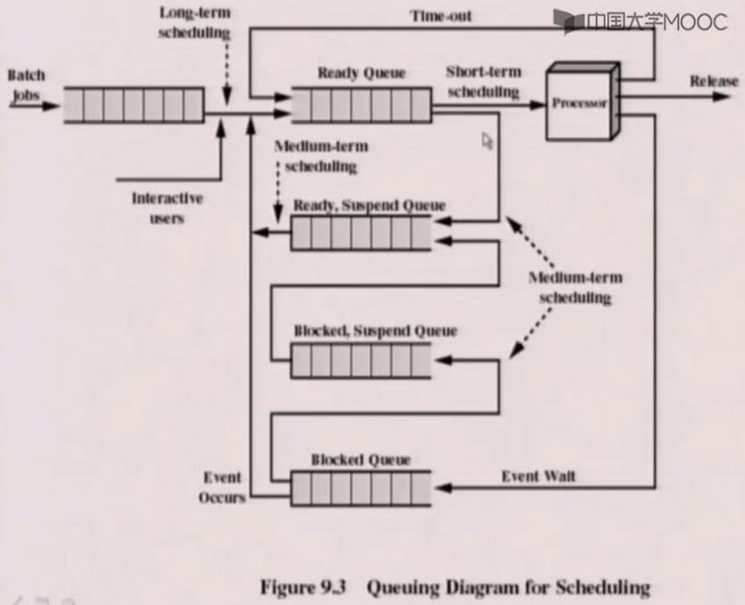
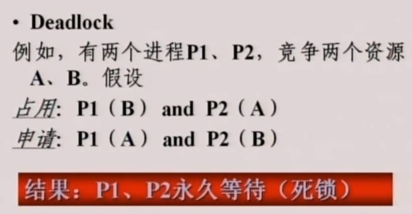
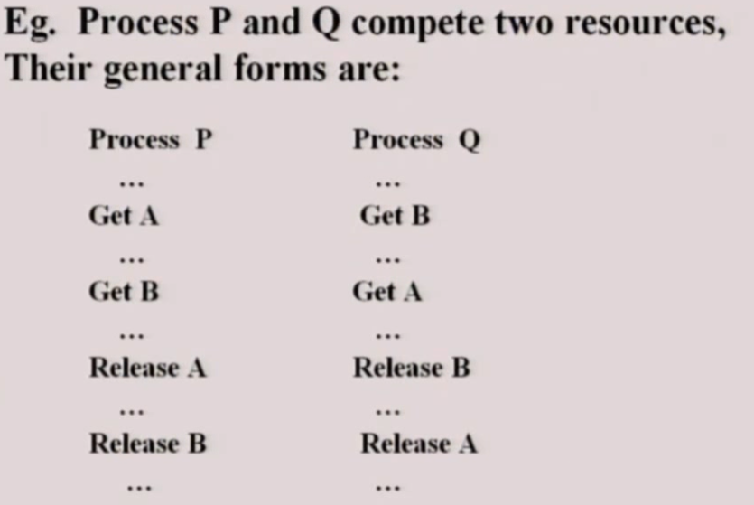
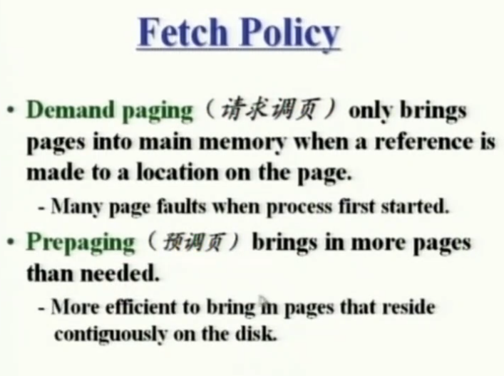

# 操作系统原理

## Part 1 Operating System Overview

1.2 操作系统的概念

1.3 基本概念

**Job**(作业)：计算机用户在一次上机过程中要求计算机系统为其所作工作的集合；作业中每项相对独立的工作为**作业步**

通常，用一组命令来描述作业；期中，每个命令定义一个作业步。

 Thread & Process

Virtual Memory & File

外存虚拟为内存；

1.4 操作系统演变

Serial Processing(串行处理)

Simple Batch Systems(单道批处理)

 Multiprogramming(多道程序设计)

Difficulties with Multiprogramming：

1. synchronize 同步，指协调
2. failed mutual exclusion互斥
3. deadlock死锁

Time sharing (分时系统)

软中断 用户内核模式的切换

## Part 2 Processes and Scheduling

2.1 进程描述与控制

进程的结构：程序+数据+PCB(Process control block,存在于内存)

进程的状态转换：Running Ready Blocked New Exit

交换技术，挂起状态 和挂起解除

PCB的管理是由操作系统内核完成

**操作系统内核**：

(资源管理功能)：进程管理和存储管理和I/O管理

(支撑功能)：中断处理，时钟管理，原语，统计，监测

**原语**：

进程切换；创建与终止；阻塞(还在内存)与唤醒；挂起(数据在外存)与激活

进程切换(一定有模式切换) VS 模式切换(软中断，用户态->系统态->用户态，进程内部实现，不一定有进程切换)

进程：资源分配单位   

**二者都是程序的执行过程**

线程：调度单位，共享进程资源

2.2 进程调度

调度类型：

目标：响应时间；系统吞吐量；处理器效率；公平性；

类型：批处理调度；分时-；实时-；多处理-；

类型：长程调度；中；短

调度准则：

面向用户：响应时间；周转时间；截止时间(best effert)；

面向系统：吞吐量；处理机利用率；资源平衡；公平性；优先级；

调度算法：

决策模式(对处理器来说)：剥夺；非剥夺

比较各种调度算法的**平均周转时间**(到达时间-完成时间)

1. FCFS(first come first served)

   非剥夺式

   对短进程和i/o-bound进程不利

2. Round Robin轮转调度法

   时间片的概念，大小(原则)，

   对i/o-bound进程不利：解决办法：virtual round robin

3. 短进程优先

4. 剩余时间最短者优先

5. 响应者高优先：(等待时间+服务时间)/服务时间

6. Feedback

实时调度：

实时系统：实时控制系统/实时信息处理系统

实时系统的特征：

+ 确定性
+ 响应性

目标：

+ 硬实时任务：在规定的截止时间内完成
+ 软实时任务：尽可能在规定的截止时间内完成
+ 公平性和最短平均响应时间不再重要

算法思路：

+ 静态表驱动调度
+ 静态优先级剥夺调度
+ 动态计划调度
+ 动态最大努力调度

具体算法：

+ 截止时间调度

2.3 进程并发

互斥：

临界区 

死锁：

进入区->临界区->退出区

互斥条件；

互斥的实现：

1. 互斥的软件实现；

2. 互斥的硬件实现：屏蔽中断；专用机器指令，产生忙等问题(消耗内存，效率低）

3. 管程

4. 消息传递 实现互斥/交换信息

   

5. 信号量(Semaphores)的两个原子操作:

+ wait(s): s - 1 :申请资源且可能阻塞自己(s < 0)

+ 临界区

+ signal(s): s + 1：释放资源并唤醒阻塞进程(s <= 0)

信号量分类：

+ 互斥信号量：初始化为1

+ 资源信号量：初始化>=1的正整数

生产者消费者：

2.4 死锁与饥饿

产生和解决方法

死锁：进程永久阻塞，由于多进程多进程竞争资源或推进顺序不当，无有效方法

特例：单进程死锁

多进程死锁：

死锁的条件：

+ 互斥
+ 保持并等待
+ 不剥夺
+ 环路等待; 一定死锁

**1.死锁预防**；不可行

+ 间接方法：禁止前三个条件发生；都不实用
  1. 互斥；不能禁止
  2. 禁止保持并等待
  3. 禁止不剥夺
+ 直接方法：不实用
  + 禁止环路

**2.避免死锁**：**银行家算法**：(把**资源**类比于**资金**)；系统开销大

+ 安全状态:存在可执行的进程序列
+ 不安全状态 

并非所有不安全状态都是死锁；

当系统进入不安全状态后，便可能进入死锁状态

只有系统处于安全状态，则可避免进入死锁状态

Claim Martrix(最大申请矩阵)

Allocation Martix(当前分配矩阵)

Need Martix = CM - AM

Resource Vector(总的资源向量)

Available Vector(可用的资源向量)

**3.检测死锁**：是否**环路等待**

哲学家就餐问题：

## Part 3 Memory Management

操作系统的启动过程

存储管理技术：

连续：分区

离散：分页，分段

简单：简单分区分页分段

虚拟：虚拟分页虚拟分段

**简单和虚拟存储管理的区别**：是否一次性装入内存

简单存储管理：

1. 分区

   1. 固定分区(内零头)

      有点：实现简单；系统开销小；

      缺点：存储利用率不高；尺寸固定，无法运行大程序；分区数目固定，活动进	程的数目受限；

   2. 动态分区(外零头)：紧凑技术

      最佳适应算法(选最小的)；**首次适应算法**；下次适应算法；最差适应算法；

   3. 伙伴系统

2. 简单分页技术

   进程分成页(page)，内存被分为页框(frame)

   

   TLB：cache根据局部性原理；加快页表访问速度

   页面大小的讨论

   大页表问题解决：

   + 虚拟页表(页表部分装入)
   + 多级页表
   + 反置页表

3. 简单分段技术

   

   段保护：

   + 越界检查
   + 存取控制，规定进程的访问权限

4. 简单段页技术

虚拟存储技术

抖动；花大量的时间i/o

虚拟存储管理技术的软件策略：

+ 驻留集管理

  

  驻留集固定分配

  驻留集动态分配：1. 工作集方法 2. PFF算法

+ 放置策略 where

  

+ 获取策略 when

  

+ 置换策略

  驻留集是固定的：局部置换策略

  可变的：全局和局部

  

页面置换算法：

+ 最佳置换算法：置换将来永远不用或最远使用的

+ 最近最少使用算法(LRU: least recently used)

+ 先进先出算法

+ 时钟算法及其改进

  

题目：

页序列；驻留集；是预调页还是求情调页；

## Part 4 Device Management

## part 5 File Management

**二级缓存**

**文件管理系统**

对于一个系统的分析：从功能和非功能两方面

**文件的逻辑组织**

组织原则；

五种文件组织；

堆文件；

顺序文件：既可以存储于磁带又可以磁盘；主要用于批处理；单挑记录性能差；

索引顺序文件：

索引文件：

哈希文件：

**文件目录**

inode

检索目录文件->inode->文件

硬连接：

软连接：类似快捷方式；URL

**文件共享**

访问权限：

+ 未知
+ 探知
+ 执行
+ 可读
+ 追加
+ 修改
+ 修改权限
+ 删除

并行存取 

**文件的存储空间的管理**

外存管理的两个功能：

+ 文件的空间分配
+ 管理空闲空间 

**连续分配**

**链式分配** 

**索引分配**

+ 一级索引
+ 多级索引

+