# 离散数学

## 一、基础知识

### 1. 集合与序列

子集<->超集

空集是唯一的

基数或者势：|A| #A card(A)

幂集：A的所有子集

序列；

### 2.数论基础

最大公因子

### 3.计数基础

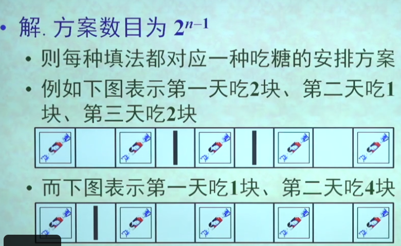

排列P(n, r)

组合C(n, r) 

鸽巢原理；

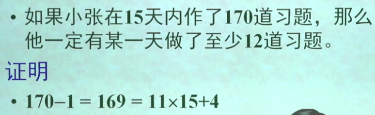

容斥原理

扩展内容：

### 4.布尔矩阵

## 二、命题逻辑

### 1. 基本概念

命题：非真既假的陈述句

命题变元或命题变项

简单命题\原子命题

复合命题

命题联结词\命题运算符

逻辑词只强调事情是否发生，而不考虑情感色彩

 

### 2.命题公式

命题的符号化：

 

### 3.等值演算

### 4.范式

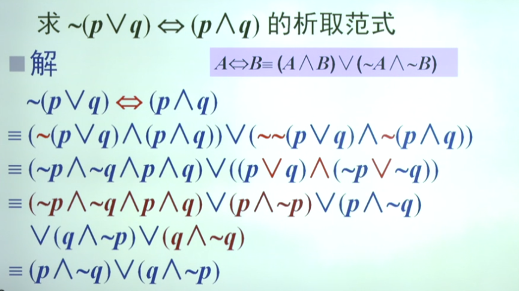

极小项极大项

主范式：

### 5.命题逻辑的推理

推理是从前提退出结论的思维过程

 

演绎法：

归结法：

## 三、谓词逻辑

### 1. 谓词与量词

个体词：

个体常项\个体变项

个体域

全总个体域

谓词

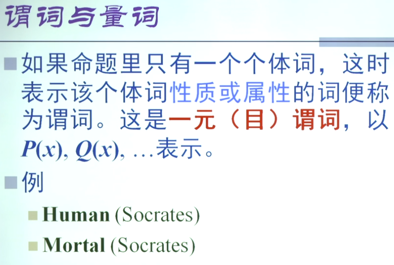

量词：

### 2. 谓词公式及其分类

### 3.自然语言形式化

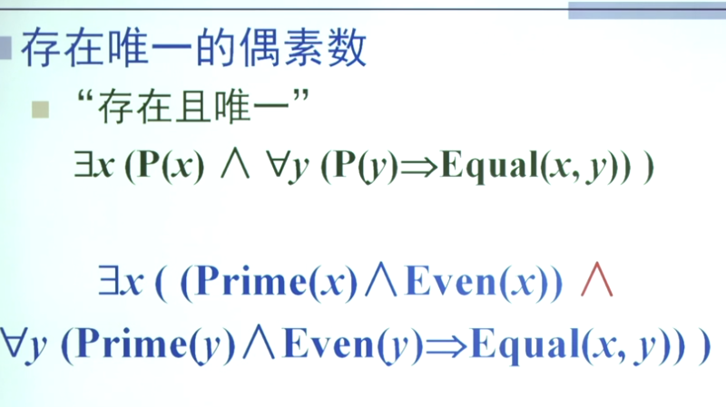

    

### 4.等值演算

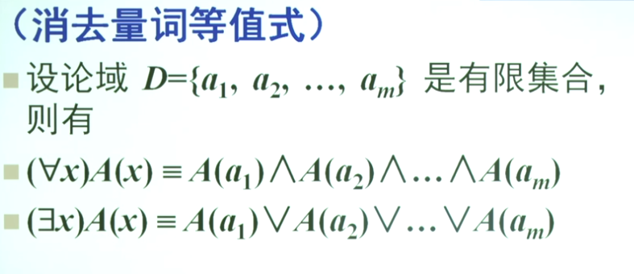

### 5.前束范式

### 6.谓词逻辑的推理

## 四、二元关系

### 1.关系及其表示

有序对：

笛卡尔积：

二元关系：

关系矩阵与关系图：

定义域、值域、像集

### 2.关系的运算

关系的基本运算

关系运算的性质：

关系的幂和道路：

### 3.关系的性质

自反关系

对称性：

传递性：

只有两种情况不具有传递性：

 关系性质的判断方法：

关系运算对性质的保持：

### 4.关系的闭包

闭包：

总结：

关系闭包运算的性质：

沃舍尔算法：

沃舍尔算法的“纸上工作法”

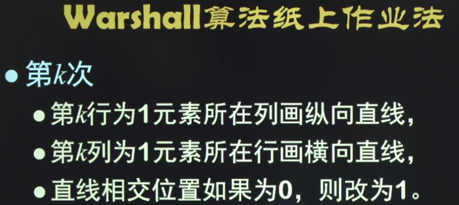

### 5.等价集合和集合的划分

划分:

等价关系，等价类和商集

由划分构造等价关系

由等价关系得到划分

 

## 五、函数

### 1.函数的定义

函数

### 2.函数的性质

### 3.函数的复合

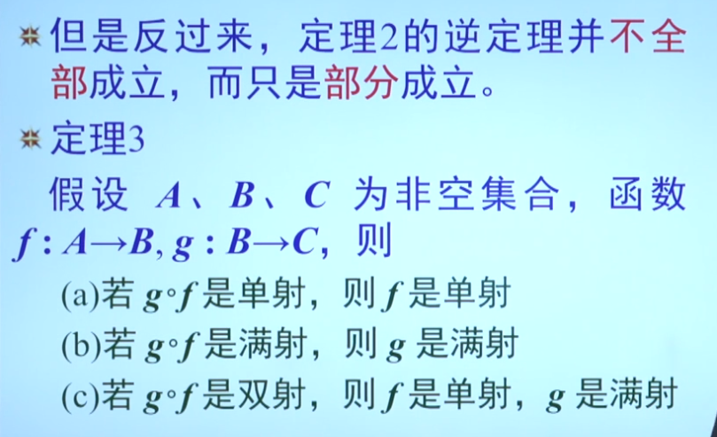

### 4.逆函数

### 5.常用函数

使用序列表示集合

哈希函数

地板函数

天花板函数

## 六、偏序关系

### 1.偏序关系和偏序集

积偏序与字典序

哈斯图

### 2.偏序集中的特殊元素

极大元与极小元

最大元与最小元

上界与下界

上确界和下确界

### 3.格

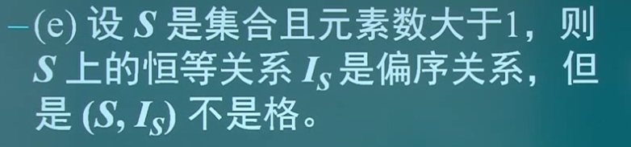

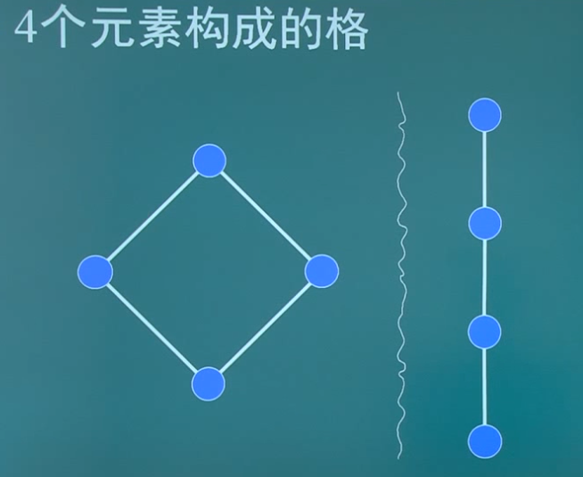

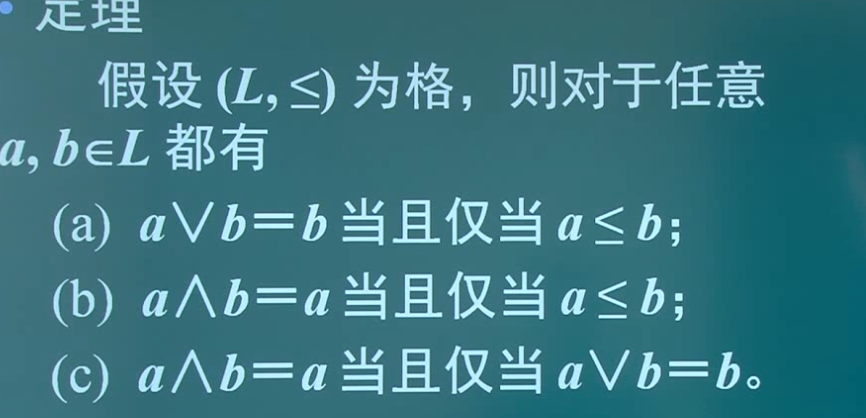

## 七、图论

### 1.图的基本概念

无向图和有向图

握手定理

特殊的图

图的同构

子图与补图

道路回路与连通性

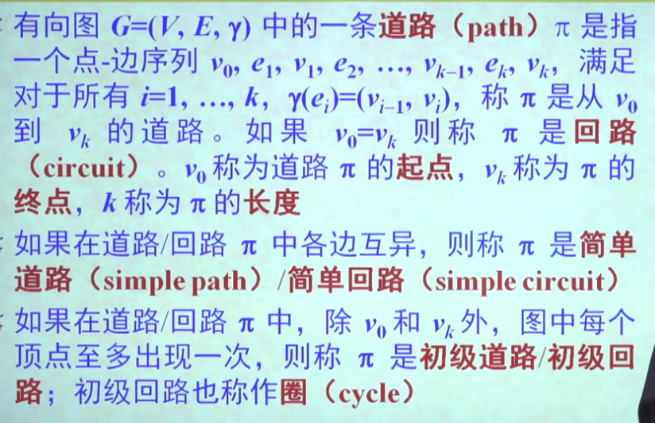

图的矩阵表示

### 2.欧拉图

欧拉道路与欧拉回路

福斯里算法

### 3.哈密尔顿图

哈密尔道路和哈密尔回路

哈密尔顿图的刻画

### 4.平面图

欧拉公式

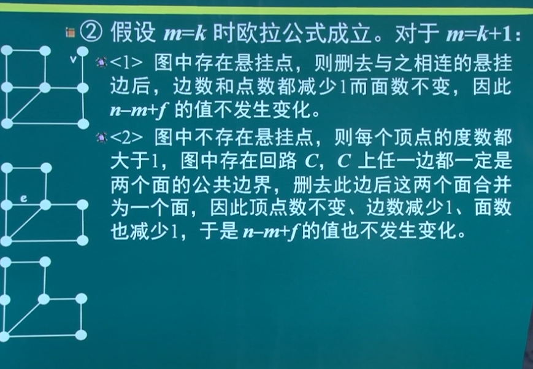

对偶图：

库拉托夫斯基定理：平面图的判定定理

 ### 5.顶点的支配、独立与覆盖

支配集

点独立集

点覆盖集：

### 6.图的着色

韦尔奇-鲍威尔算法：

四色定理

拉姆齐数

