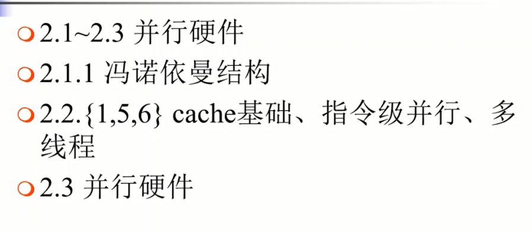

# 并行与分布式程序设计

## 1. 前言

**教材**

《并行程序设计导论》- 机械工业出版社，2012

**参考教材**

《并行计算导论》(原书第二版) - 机械工业出版社

《MPI并行程序设计实例教程》- 清华大学出版社

《CPU高性能运算之CUDA》 - 中国水利水电出版社

**沟通方式**

孙永谦：sunyongqian@nankai.edu.cn

实验室主页：http://nkcs.iops.ai

**课程要求**

成绩：40% 编程作业  60% 期末闭卷考试

**课程概要**

1. 重要问题要求强大的计算机
   - 强大的计算机是并行机
   - 并行程序员是性能优化专家
2. 开发高性能并行应用
3. 并行的部分结构
   - SSE/AVE(单核)、多核、GPU、集群

**课程目标**

1. 学习并行系统上的编程
2. 手动获得经验
3. 讨论当前的并行计算环境

## 2.课程笔记

### 一.绪论

1. 推动并行计算的因素
   + 处理器能力，硬件限制
   + 其他领域的推动
2. 并行计算的应用
   + 科学仿真
3. 超级计算机硬件的发展
4. 软件技术面临的挑战
5. 众核技术/GPU的发展

预习：